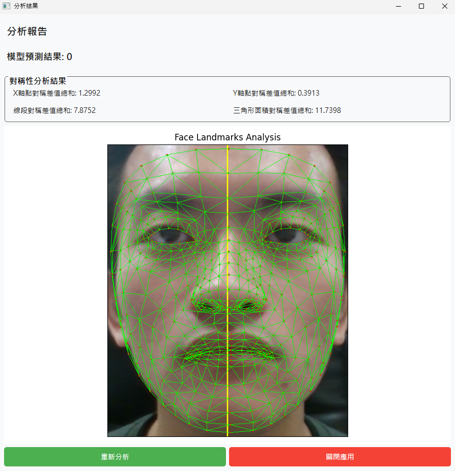

# AD-Sensor-Project

An Alzheimer's Disease screening system using facial analysis and questionnaire data.


## Project Structure
```
AD-Sensor-Project/
├── _images
│   ├── UI
│   │   ├── analysis_report_window.png
│   │   ├── patient_data_form.png
│   │   ├── pic_caping_window_end.png
│   │   └── pic_caping_window_start.png
│   └── UI_alpha
│       ├── pic_caping_window_re_connect_cam.png
│       ├── pic_caping_window_re_connect_cam_success.png
│       ├── pic_caping_window_re_connect_LED.png
│       └── pic_caping_window_re_connect_LED_success.png
├── arduino/
│   └── LED.ino                 # Arduino LED control sketch
├── data/
│   ├── .gitignore
│   ├── haarcascade_frontalface_default.xml
│   ├── symmetry_all_pairs.csv  # Facial symmetry mapping
│   └── XGBoost.json            # Pre-trained ML model
├── ui/
│   ├── pages/                  # UI windows
│   │   ├── patient_data_form.py
│   │   ├── pic_caping_window.py
│   │   └── analysis_report_window.py
│   └── styles/                 # UI styling
├── utils/                      # Core functionality
│   ├── analysis_pic.py         # Face analysis algorithms
│   ├── cap_pic.py              # Camera capture utilities
│   ├── led_controller.py       # Arduino communication
│   └── predict_questionaire.py # ML prediction
├── .gitignore                  
├── main.py                     # Application entry point
├── poetry.lock                 # Locked dependency versions
├── pyproject.toml              # Poetry dependencies
└── README.md
```

## Installation

### Prerequisites
- Python 3.11.x
- Intel RealSense SDK
- Arduino IDE (for LED functionality)
- Git

### Setup Steps

1. **Clone the repository**
   ```bash
   git clone https://github.com/a7266165/AD-Sensor-Project.git
   cd AD-Sensor-Project
   ```

2. **Create Python environment**
   ```bash
   python -m venv venv
   # Windows
   venv\Scripts\activate
   # macOS/Linux
   source venv/bin/activate
   ```

3. **Install dependencies**
   ```bash
   pip install poetry
   poetry install --no-root
   ```

4. **Upload Arduino sketch** (Optional for LED feature)
   - Open `arduino/LED.ino` in Arduino IDE
   - Connect Arduino board
   - Upload the sketch

## Usage

### Starting the Application
```bash
python main.py
```

### Testing Individual Components
```bash
# Test patient form
python ./ui/pages/patient_data_form.py

# Test camera window
python ./ui/pages/pic_caping_window.py

# Test analysis window
python ./ui/pages/analysis_report_window.py
```

## Data Format
Patient data is stored in CSV format with the following structure:

| Field | Description |
|-------|-------------|
| ID | Patient identifier |
| cap_date | Capture date (YYYY-MM-DD) |
| gender | Patient gender |
| birthday | Date of birth (YYYY-MM-DD) |
| education_years | Years of education |
| q1-q10 | Questionnaire responses (1-10) |

## UI Screenshots

### Patient Data Form


### Camera Capture


### Analysis Results


### Device Reconnection Features(Alpha)
<details>
<summary>LED Reconnection</summary>


</details>

<details>
<summary>Camera Reconnection</summary>


</details>

## Hardware Requirements

- **Camera**: Intel RealSense D435/D415 or compatible
- **Arduino**: Arduino Uno/Mega with LED circuit (optional)
- **Computer**: not decide

