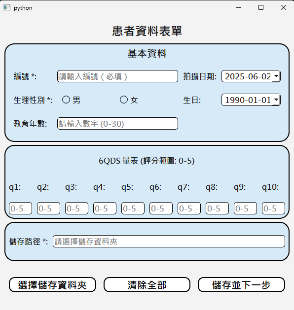
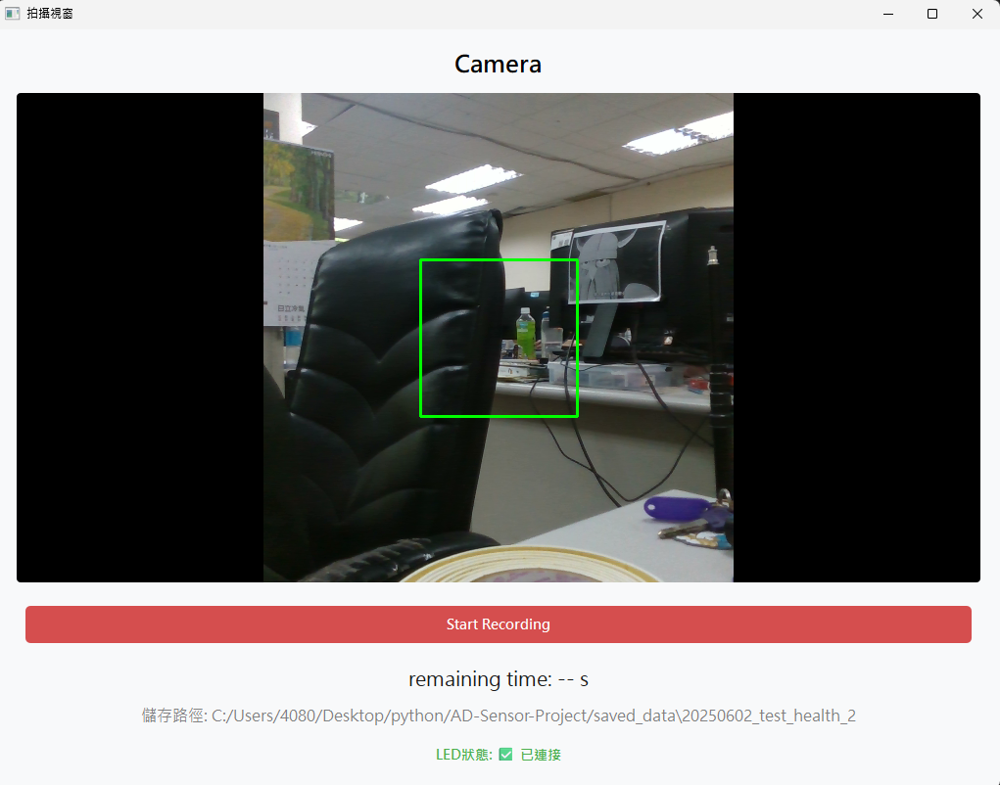
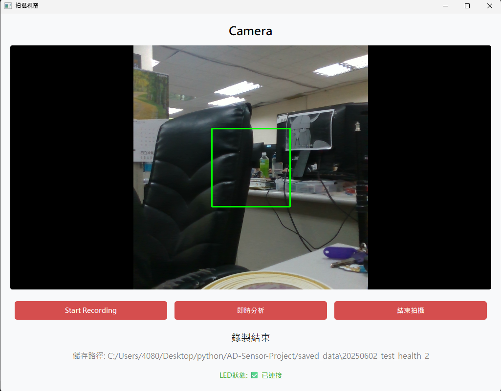
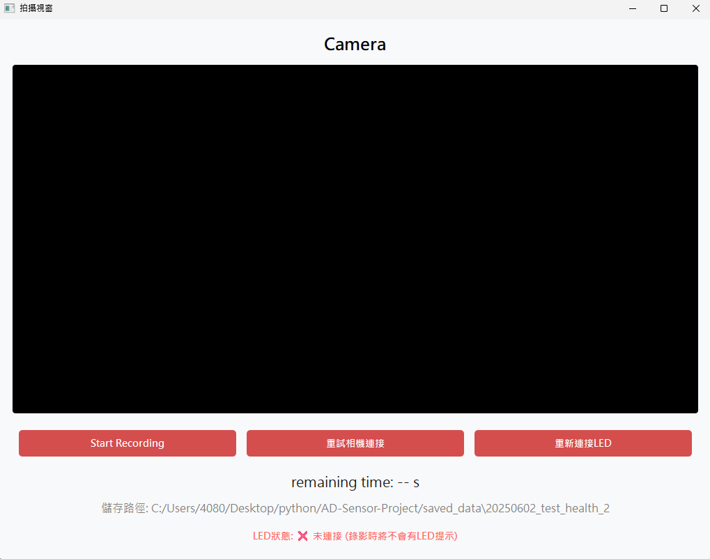
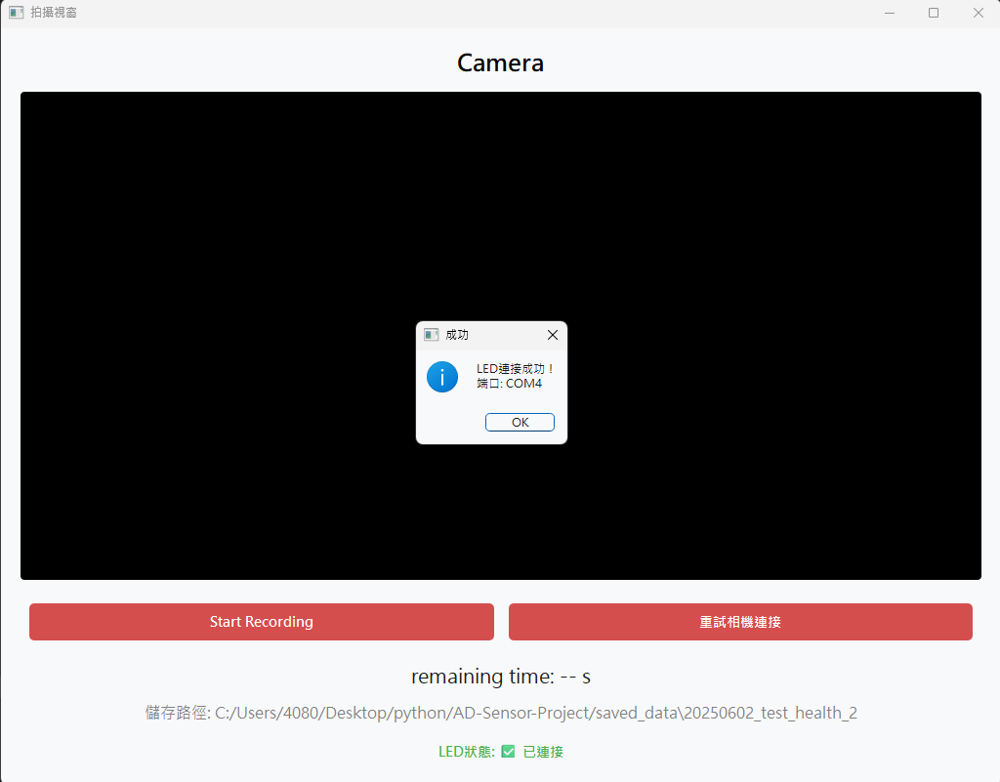
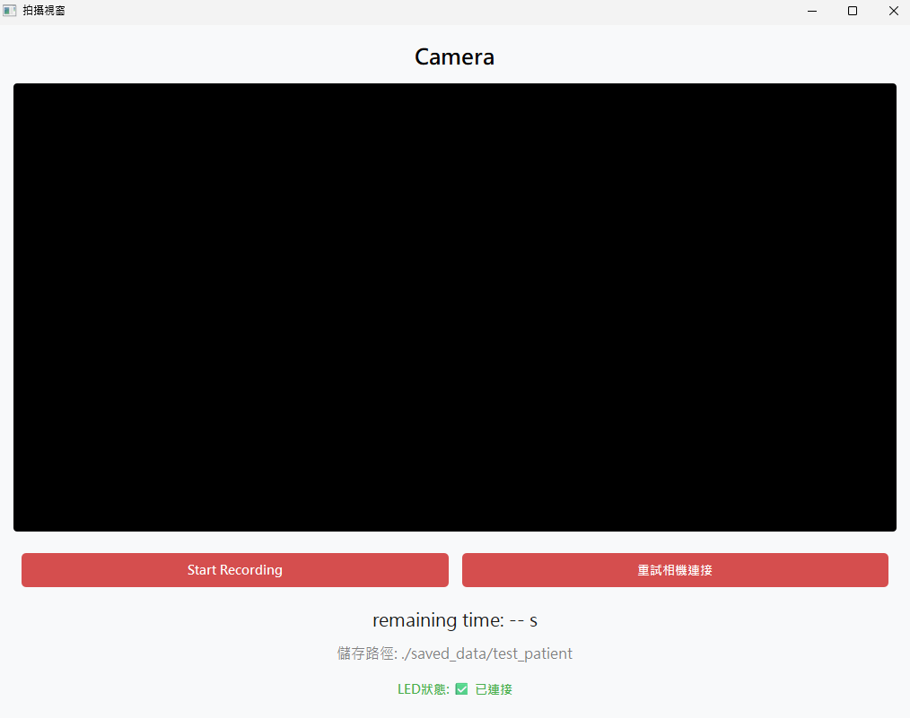
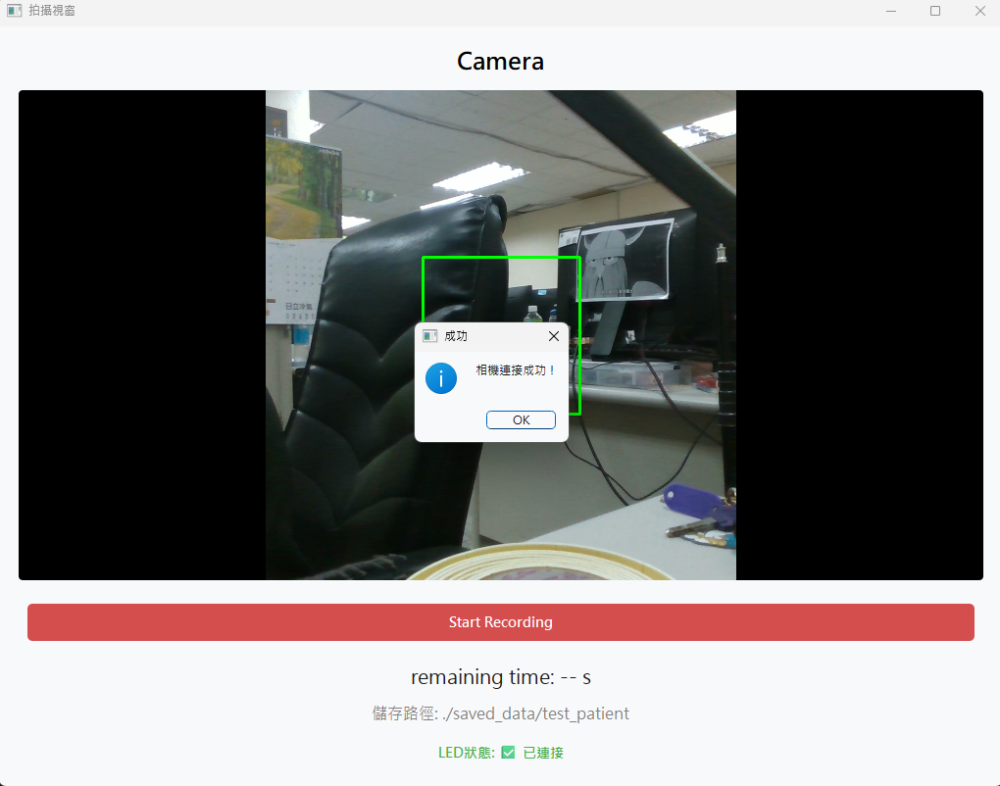

AD-Sensor-Project

# 結構樹
```
├── .gitignore
├── arduino
│   └── LED.ino
├── data
│   ├── .gitignore
│   ├── haarcascade_frontalface_default.xml
│   ├── symmetry_all_pairs.csv
│   └── XGBoost.json
├── main.py
├── poetry.lock
├── pyproject.toml
├── README.md
├── test_util
│   └── connect_arduino.py
├── ui
│   ├── pages
│   │   ├── analysis_report_window.py
│   │   ├── patient_data_form.py
│   │   └── pic_caping_window.py
│   └── styles
│       ├── analysis_report_window_style.py
│       ├── patient_data_form_style.py
│       └── pic_caping_window_style.py
└── utils
    ├── analysis_pic.py
    ├── cap_pic.py
    ├── led_controller.py
    └── predict_questionaire.py

```

# 快速啟動程式
(1) 複製專案
git clone https://github.com/a7266165/AD-Sensor-Project.gitl

(2) 切換至專案目錄
cd AD-Sensor-Project

(3) 創建環境 (python >=3.11,<3.12)

(4) 切換至該環境，使用 Poetry 安裝相關套件
poetry install --no-root

(5) 啟動界面
python main.py

(5-1) 各頁面獨立測試
python ./ui/pages/patient_data_form.py
python ./ui/pages/patient_data_form.py
python ./ui/pages/analysis_report_window.py

# 基本資料儲存格式
ID,cap_date,gender,birthday,education_years,q1,q2,q3,q4,q5,q6,q7,q8,q9,q10
ID: 患者識別碼
cap_date: 資料捕捉日期
gender: 性別
birthday: 出生日期
education_years: 教育年數
q1-q10: 問卷題目回答 (1-10題)

# 界面
(1) 基本資料表單


(2) 開始拍攝


(3) 拍攝結束


(4) 呈現分析結果


# 實驗性功能
(1) LED重連接




(2) 相機重連接



